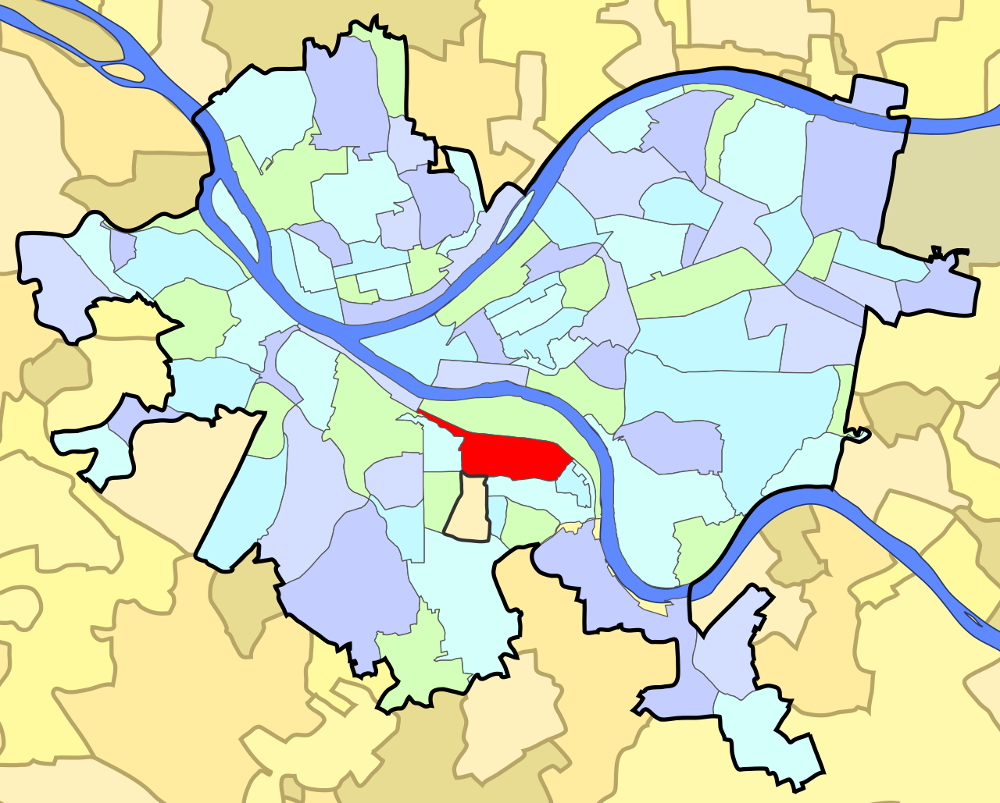
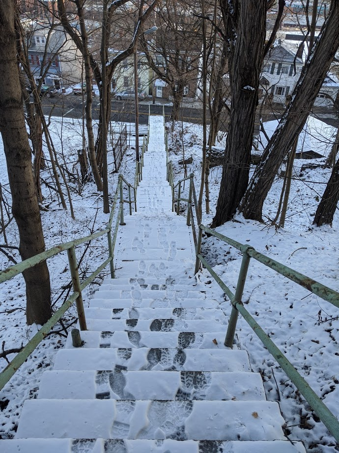
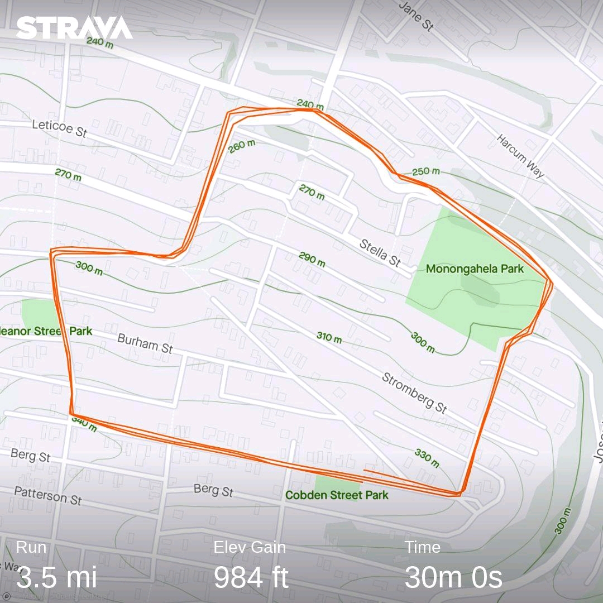
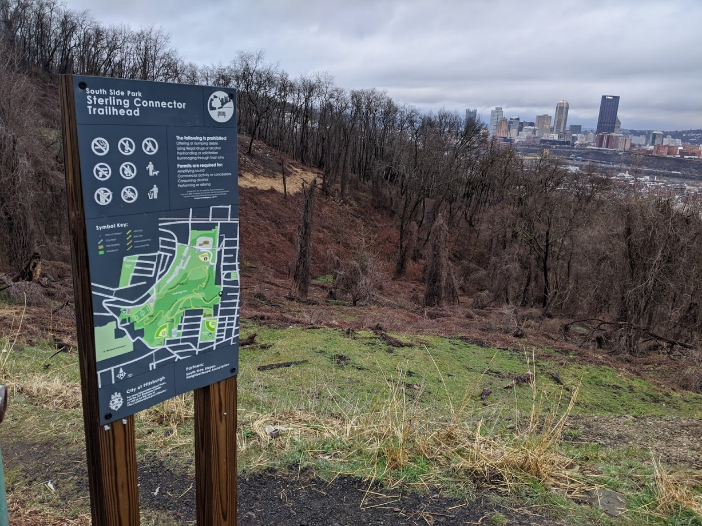
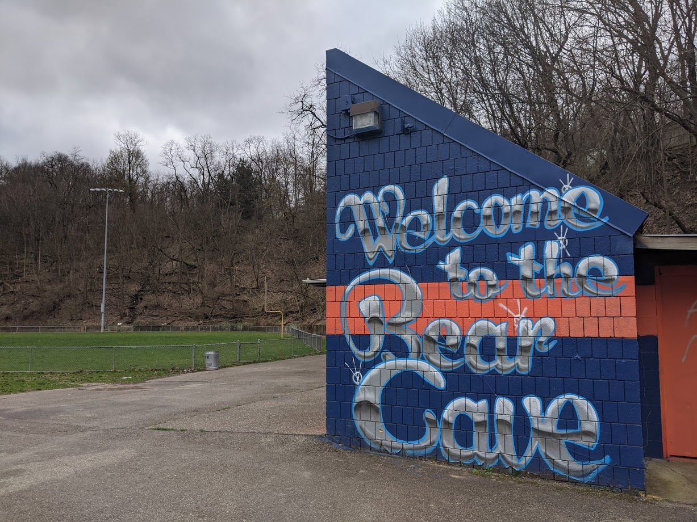
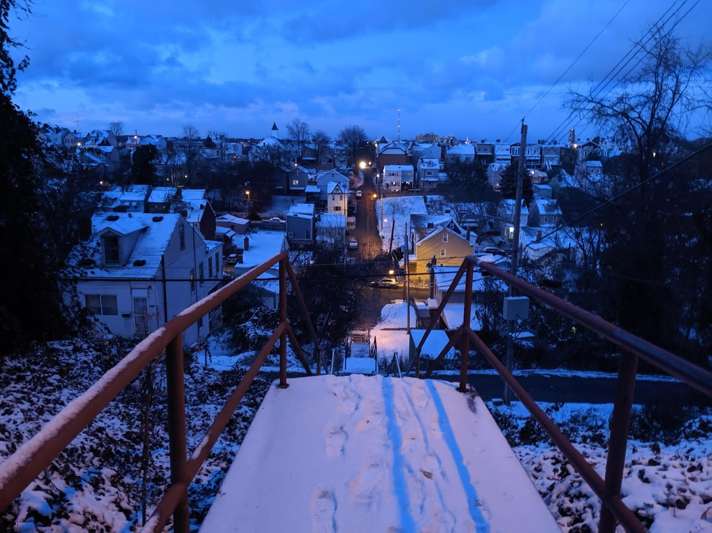
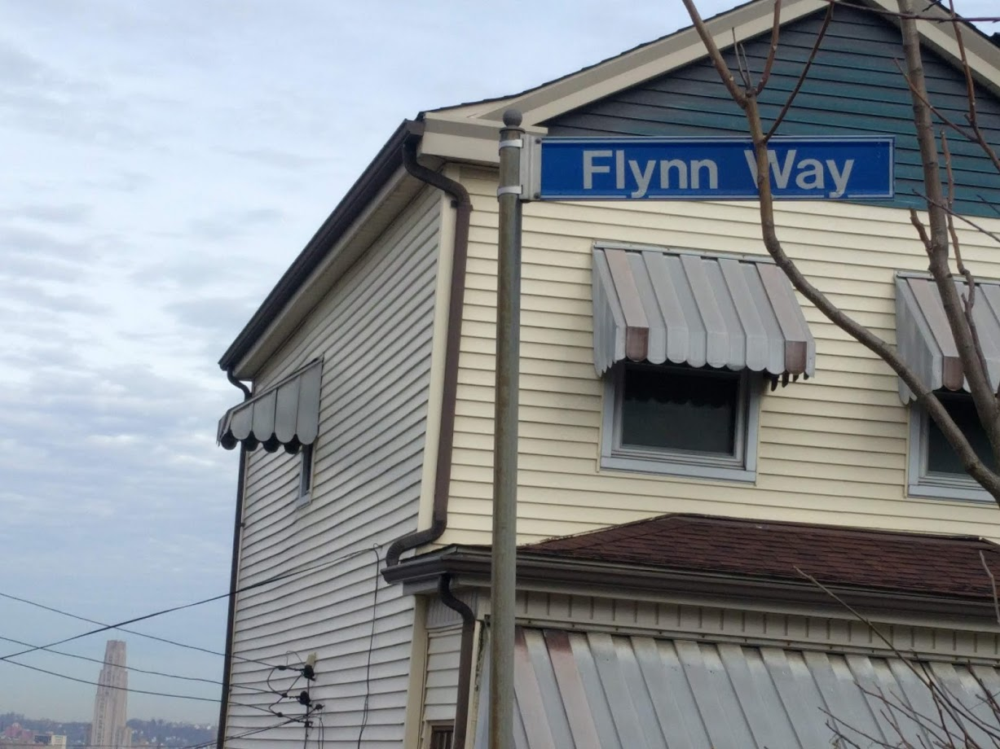

# South Side Slopes

## Overview

{:height="500px" width="500px"}

The South Side Slopes is located above the South Side Flats, on the hills overlooking the Monongahela River.  They are referred to by locals as "The Slopes", and are known for steep, narrow streets, and many sets of public steps.

## Some Thoughts

I've lived in the Slopes since the summer of 2019, and have really enjoyed my time in this neighborhood.  The topography has a great way of keeping people out, so it's actually surprisingly quiet on my street and I have gotten to know my neighbors quite well.  Also, I have found it to be an economically and politically diverse neighborhood, which is refreshing.  For every fixed up house with a nice fancy view of Downtown, there is also a family that's lived here "forever" and hasn't been priced out.

Also, due to the difficult terrain there is a decent amount of green and undeveloped space.  These (usually) steep hillsides provide places for some wildlife to live.  It's not uncommon to see deer, rabbit, and birds in my yard.  I have even seen video (but not in person) of a coyote roaming around.  With Hays Woods (famous for their bald eagles) not far away, this isn't that surprising.

## The Steps

Public steps are pretty common throughout Pittsburgh, but the South Side Slopes have more of them than any other neighborhood, so I figure I'll devote a section to them here.

The steps provide a great way for residents to get up and down the Slopes, and also work well for exercising.  When I'm doing my normal commute to Downtown, I take the stairs shown above to my bus stop.

Each year, the South Side Slopes Neighborhood Association puts on StepTrek, an event that showcases the many steps.  Details about that event can be found here: [http://www.southsideslopes.org/steptrek/](http://www.southsideslopes.org/steptrek/)

There has been much written about the steps, so I'll provide some links here that I found particularly interesting:
* [https://www.discovertheburgh.com/south-side-slopes/](https://www.discovertheburgh.com/south-side-slopes/)
* [http://www.southsideslopes.org/steptrek/church-route/](http://www.southsideslopes.org/steptrek/church-route/)
* [http://secretpittsburgh.pitt.edu/node/250](http://secretpittsburgh.pitt.edu/node/250)
* [90.5 WESA Steps Story](https://www.wesa.fm/post/south-side-slopes-resident-takes-good-care-city-steps#stream/0)
* [The Steps of Pittsburgh - Portrait of a City](https://www.goodreads.com/book/show/136310.The_Steps_of_Pittsburgh)

## Highlighted Run

{:height="500px" width="500px"}

[View on Strava](https://www.strava.com/activities/3187247266)

This particular run was done on 3/15/2020, and for some reason I decided it would be a good idea to run up Barry/Holt/Eleanor 3 times.  I left from home, then went down some stairs to Josephine and looped back up.  Mentally, each loop got a little easier, but physically this was a tough one.  My main goal was run get 1k elevation in a 5K, but I came up a little short.

Running in the Slopes in general is great.  It really teaches you to not be afraid of hills, and South Side Park has some nice trails that I would recommend.  Living (and running) here has definitely made me a better hill runner.

## Photo Gallery

